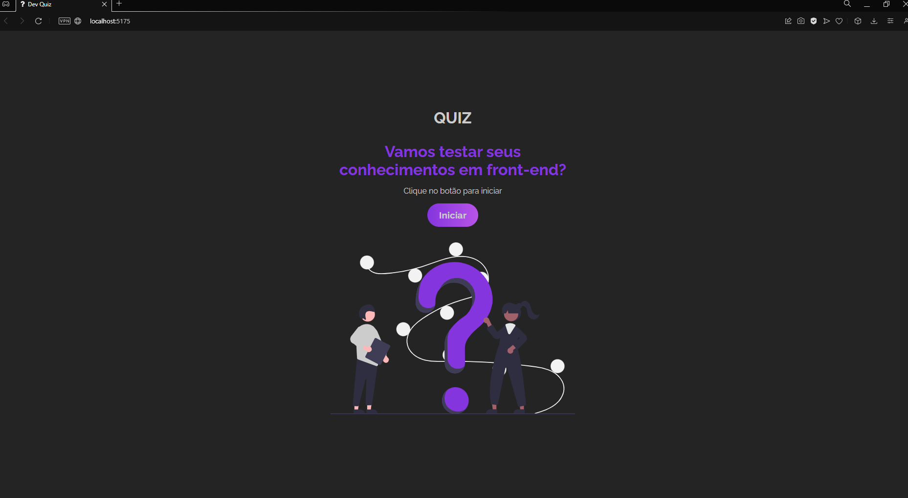
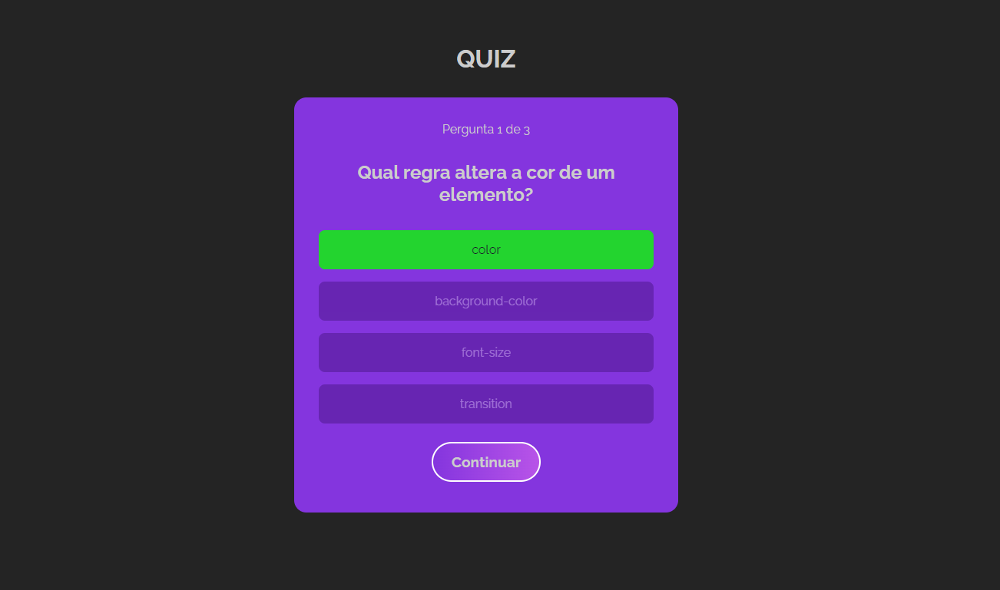
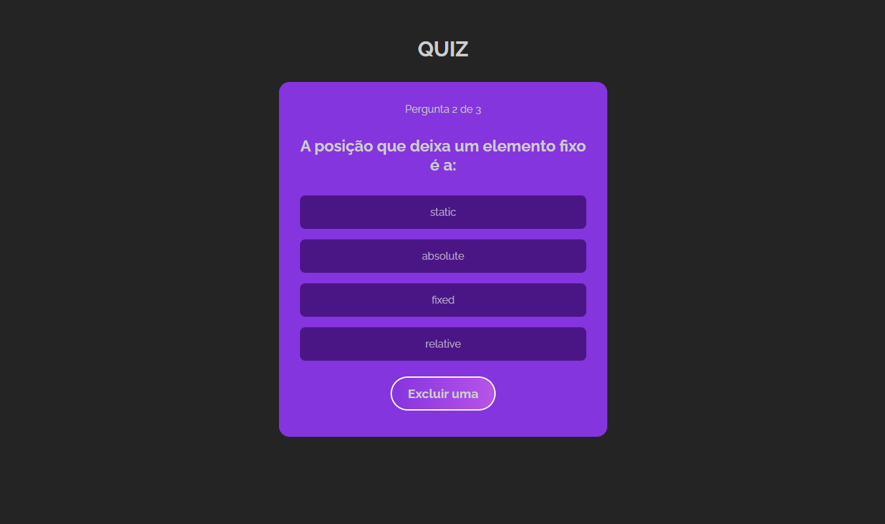
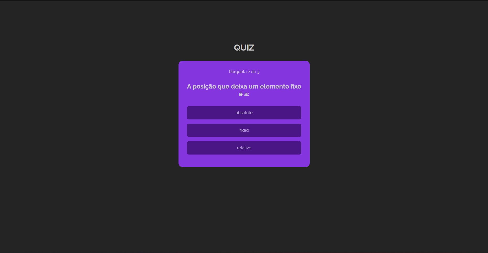
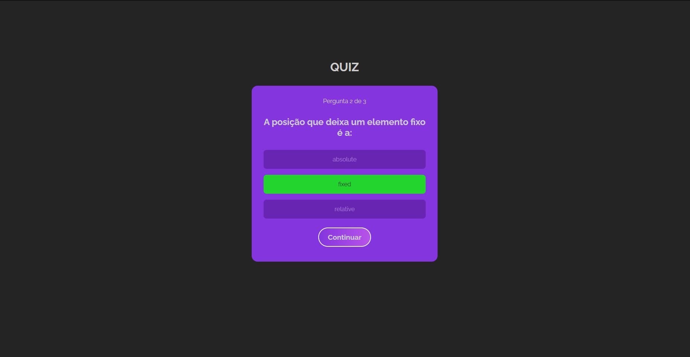
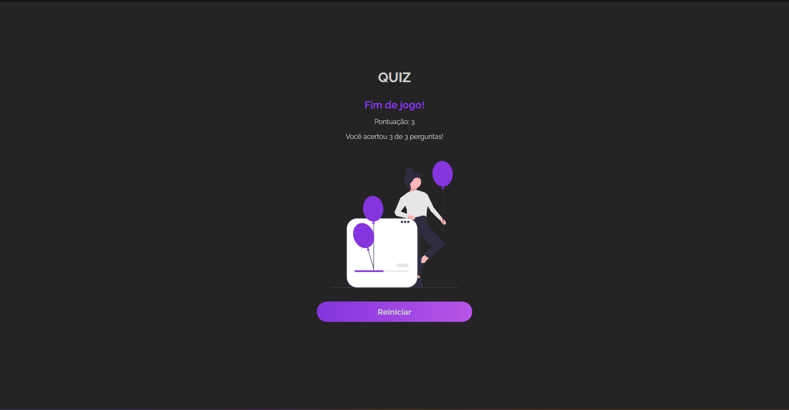

<h1 align="center"> Quiz em Front-end </h1>

Its a React JS project, that trains components, contexts and hooks in react. It's a quiz with 3 different categories that are easy to solve.  

  <a href="#-tecnologias">Techs/Tecnologias</a>&nbsp;&nbsp;&nbsp;|&nbsp;&nbsp;&nbsp;
  <a href="#-projeto">Project/Projeto</a>&nbsp;&nbsp;&nbsp;|&nbsp;&nbsp;&nbsp;
  <a href="#-layout">Layout</a>&nbsp;&nbsp;&nbsp;|&nbsp;&nbsp;&nbsp;
  <a href="#memo-licença">License/Licença</a>

  

  

  

  

  

  

  

## 🚀 Techs / Tecnologias

Esse projeto foi desenvolvido com as seguintes tecnologias:

- HTML e CSS
- JavaScript
- React Js
- React Router
- Git e Github

## 💻 Project / Projeto

A project that trains components, contexts and hooks in react. It's a quiz with 3 different categories that are easy to solve: css, html and javascript, the last two with 5 questions. In all categories we can logically exclude an option. In css we can also choose a tip.

Um projeto que treina componentes, contextos e hooks no react. É um quiz com 3 categorias diferentes de fácil resolução são elas: css, html e javascript, essas duas ultimas com 5 perguntas. Em todas categorias podemos exluir uma opção de maneira lógica. No css também podemos escolher uma dica.

## 🔖 Layout

Você pode visualizar o layout do projeto através do repositório. 

Feito com amor por Lara.
Made w/ love by Lara.